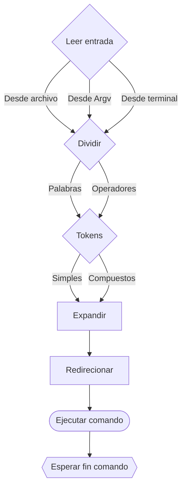

<h1 align="center">
  

	minishell

</h1>
 

## [Funciones permitidas](markdown/allowed.md)

## [Instalación libreadline](markdown/libreadline.md)

## Usadas

pipe, perror, dup2, execve, access

```mermaid
flowchart TD
    A{Leer entrada}
    A -->|Desde archivo| B{Dividir}
    A -->|Desde Argv| B
    A -->|Desde terminal| B
    B --> |Palabras| C{Tokens}
    B --> |Operadores| C
    C --> |Simples| D[Expandir]
    C --> |Compuestos| D
    D --> E[Redirecionar] --> F
    F([Ejecutar comando]) --> G
    G{{Esperar fin comando}}
```
